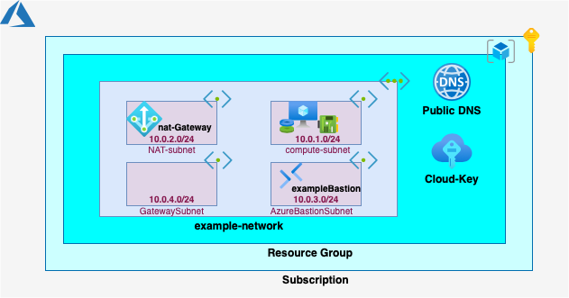

<!-- This should be the location of the title of the repository, normally the short name -->
# tf-azure-landing-zone
# Terraform script to deploy a lite landing zone on Azure along with a Compute instance

<!-- Build Status, is a great thing to have at the top of your repository, it shows that you take your CI/CD as first class citizens -->
<!-- [](https://travis-ci.org/jjasghar/ibm-cloud-cli) -->

<!-- Not always needed, but a scope helps the user understand in a short sentance like below, why this repo exists -->
## Scope

The purpose of this repository is to provide example code to demonstrate how components of a Hyperscalar Cloud a.k.a. Landing Zone can be deployed using Terraform on Azure. Terraform provides a common infrastructure-as-code provisioning methodology across multiple providers (AWS, Azure, GCP, IBM) and can be integrated with other configuration management infrastructure-as-code platforms like Ansible.

This repository when run will deploy the infrastructure as depicted in the diagram. The configuration of the Compute Instance is not in the scope of this respository.


<!-- A more detailed Usage or detailed explaination of the repository here -->
## Usage

Update the key variables in terraform.tfvars file and execute terraform as described in (Execution) below.


Key files:

- terraform.tfvars: User provided variable (see configuration below)
- provider.tf: Terraform variable declaration, called as var.* in other files
- compute.tf: Compute instance, deploys instance in subnet, attaches public IP, attaches storage
ami.tf: Amazom Machine Image(s) for use in EC2 instance

Execution:

To deploy the infrastructure components

- `terraform init`
- `terraform plan -out="instance.plan"`
- `terraform apply "instance.plan"`

To remove the infrastructure

- `terraform plan -destroy -out="instance.destroy.plan"`
- `terraform apply "instance.destroy.plan"`

Configurations:

The deployment requires the following details:

IAM details to access Azure:
- client_secret
- client_id
- tenant_id
- subscription_id
- secret_id

Additionally
- resource_group_name: Name of the resource group in which the resources are being created
- public_key_path: Path to file for the public key to install for server access

terraform.tfvars: Provides the user entries for the above details

provider.tf: Provides terraform with placeholders for variables that can be provided through terraform.tfvars or through Ansible

Cleaning up:

No clean up is required post running the script(s).

<!-- License and Authors is optional here, but gives you the ability to highlight who is involed in the project -->
## License & Authors

If you would like to see the detailed LICENSE click [here](LICENSE).

- Author: Sayan A Ghosh <sayan.acharya.ghosh@kyndryl.com>
- Maintainer: Sayan A Ghosh <sayan.acharya.ghosh@kyndryl.com>

```text
Copyright:: 2022-2022 Kyndryl, Inc

Licensed under the Apache License, Version 2.0 (the "License");
you may not use this file except in compliance with the License.
You may obtain a copy of the License at

http://www.apache.org/licenses/LICENSE-2.0

Unless required by applicable law or agreed to in writing, software
distributed under the License is distributed on an "AS IS" BASIS,
WITHOUT WARRANTIES OR CONDITIONS OF ANY KIND, either express or implied.
See the License for the specific language governing permissions and
limitations under the License.
```
